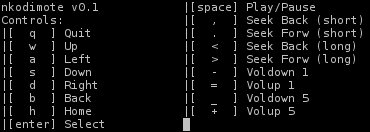

nkodimote
=========

A really quite mediocre ncurses (or whatever python curses is) kodi remote.

Patches and pull requests welcome.

To use, edit the source and set the correct hostname and port for your setup and then run (python3).

Controls
--------
 - q - Quit
 - w - Up
 - a - Left
 - s - Down
 - d - Right
 - b - Back
 - h - Home
 - enter - Select
 - space - Play/Pause (Hopefully)
 - , - seek backwards (short)
 - . - seek forwards (short)
 - < - seek backwards (long)
 - > - seek forwards (long)
 - - - voldown 1
 - = - volup 1
 - _ - voldown 5
 - + - volup 5
